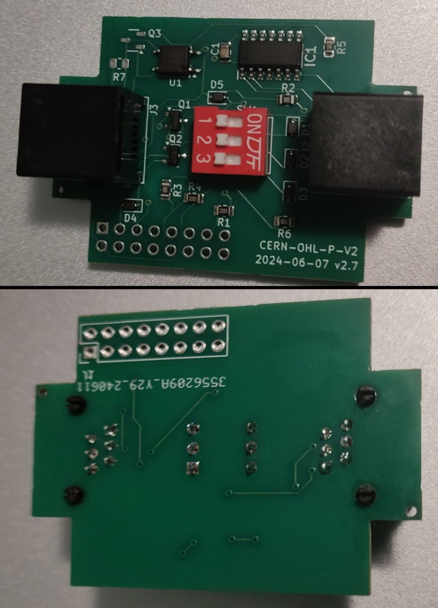

# Twomes hardware repository template

This repository contains the open hardware design files for the Twomes something device, which can be used as a [WeMos D1 Mini shield](https://www.wemos.cc/en/latest/d1_mini_shield/index.html), on top of a WeMos D1 Mini board, such as the [LilyGO TTGO T7 Mini32 V1.3 ESP32](https://github.com/LilyGO/ESP32-MINI-32-V1.3), which is based on an ESP32 SoC, or the [Wemos LOLIN D1 mini](https://www.wemos.cc/en/latest/d1/d1_mini.html), which is based on an ESP8266 SoC. 

The shield the function of the shield, e.g. "It can measure CO₂ concentration, relative humidity and temperature of a room".

## Table of contents
* [General info](#general-info)
* [Prerequisites](#prerequisites)
* [Producing](#producing)
* [Developing](#developing) 
* [Features](#features)
* [Status](#status)
* [License](#license)
* [Credits](#credits)

## General info
This repository contains the open hardware designs files for the Twomes something shield. It also includes a `docs` folder with recent printouts of the [schematics](./docs/twomes-hardware-repository-sch.pdf) and [PCB layout](./docs/twomes-hardware-repository-pcb.pdf). 

For the associated firmware that you can run on this device, please see [this repository](https://github.com/energietransitie/twomes-software-repository-template).

## Producing

### Printed Circuit Board
To fabricate the printed circuit board you can use various PCB services. 

The folder [pcb/jlcpcb](./pcb/jlcpcb) includes all exported files needed to have the PCBs manufactured by [JLCPCB](https://www.jlcpcb.com). Upload the [zipped gerber files](./pcb/jlcpcb/gerber/gerber-TwomesSomething.zip) to the [JLCPCB quote page](https://cart.jlcpcb.com/quote), select the amount of PCBs and a colour for the silkscreen. All other options can be left on default.  If SMT assembly is desired, also select this option before ordering. This will take you to a page where the BOM and POS file can be uploaded. Use the files [BOM-TwomesSomething.csv](./pcb/jlcpcb/assembly/BOM-TwomesSomething.csv) and [CPL-TwomesSomething.csv](./pcb/jlcpcb/assembly/CPL-TwomesSomething.csv).

In the current version of this design, no SMT assembly is used. Hence, we do not provide BOM*.csv and CPL-*.csv files in the folder [pcb/jlcpcb/assembly](./pcb/jlcpcb/assembly)

### Enclosure
To fabricate the enclosure you can use your own 3D printer or use a 3D printing service. 

The folder [enclosure/fabrication](./enclosure/fabrication) contains exported STL files for the [case](./enclosure/fabrication/twomes-hardware-repository-template-case.stl) and [lid](./enclosure/twomes-hardware-repository-template-lid.step) of the Twomes Something device enclosure. The STL files can be imported into any slicer and turned into G-Code for a 3D printer.

## Developing
### Printed Circuit Board
To change the hardware design of the PCB, you need:
* [KiCad](https://www.kicad.org/download/) installed to change te PCB design. 

The KiCad source files of the PCB can be found in the folder [pcb](./pcb).

To convert the PCBs into a format suitable for fabrication, consult the webpage of your PCB manufacturer of choice. For example, see the [JLCPCB guide on how to export Gerbers](https://support.jlcpcb.com/article/149-how-to-generate-gerber-and-drill-files-in-kicad) and the  [JLCPCB guide how to export the BOM and POS files](https://support.jlcpcb.com/article/84-how-to-generate-the-bom-and-centroid-file-from-kicad). You may also use a KiCad plug-in for this purpose such as [kicad-jlcpcb-tools](https://github.com/Bouni/kicad-jlcpcb-tools).

### Enclosure
To change the hardware design of the enclosure, you need either:
* [Autodesk Fusion 360](https://www.kicad.org/download/) installed (Autodesk provides 30 day free trials and [free one-year educational access](https://www.autodesk.com/education/edu-software/overview?sorting=featured&filters=individual) to its products and services for eligible students, teachers and research staff); 
* or [FreeCAD](https://www.freecadweb.org/), an open source alternative.

The source files of the enclosure can be found in the folder [enclosure](./enclosure). We include both .f3d source files and .step source files we obtained after conversion.
## Features
The Twomes Something Shield features the follwoing main hardware components:
* awesome feature 1;
* awesome feature 2;
* awesome feature 3.

To-do:
* wow improvement to be done 1;
* wow improvement to be done 2.

## Status
Project is:  _in progress_, _finished_, _no longer continued_ and why?

## License
The hardware designs in this repository are available under the [CERN-OHL-P v2 license](./LICENSE), Copyright 2022 [Research group Energy Transition, Windesheim University of Applied Sciences](https://windesheim.nl/energietransitie)

## Credits
This open hardware design is a collaborative effort of:
* <contributor name 1> · [@Github_handle_1](https://github.com/<github_handle_1>) · Twitter [@Twitter_handle_1](https://twitter.com/<twitter_handle_1>)
* <contributor name 2> · [@Github_handle_2](https://github.com/<github_handle_2>) · Twitter [@Twitter_handle_2](https://twitter.com/<twitter_handle_2>)
* <contributor name 3> · [@Github_handle_3](https://github.com/<github_handle_3>) · Twitter [@Twitter_handle_3](https://twitter.com/<twitter_handle_3>)
* etc. 

Thanks also go to:
* <thanks name 1> · [@Github_handle_1](https://github.com/<github_handle_1>) · Twitter [@Twitter_handle_1](https://twitter.com/<twitter_handle_1>)
* <thanks name 2> · [@Github_handle_2](https://github.com/<github_handle_2>) · Twitter [@Twitter_handle_2](https://twitter.com/<twitter_handle_2>)
* <thanks name 3> · [@Github_handle_3](https://github.com/<github_handle_3>) · Twitter [@Twitter_handle_3](https://twitter.com/<twitter_handle_3>)
* etc. 

Product owner:
* <remove this line; common product owners listed for your convenience below>
* Henri ter Hofte · [@henriterhofte](https://github.com/henriterhofte) · Twitter [@HeNRGi](https://twitter.com/HeNRGi)
* Marco Winkelman · [@MarcoW71](https://github.com/MarcoW71)

We use and gratefully acknowlegde the efforts of the makers of the following designs:

* [library name 1 and version](library 1 URL), by <copyright holder name 1>, licensed under [license 1 name](license1 URL)
* [library name 2 and version](library 2 URL), by <copyright holder name 2>, licensed under [license 2 name](license2 URL)
* [library name 3 and version](library 3 URL), by <copyright holder name 3>, licensed under [license 3 name](license3 URL)
* etc. 
