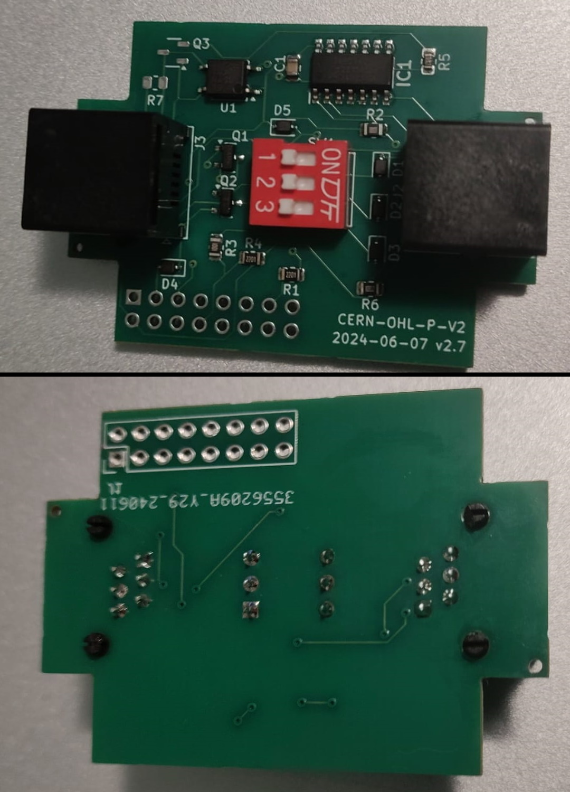
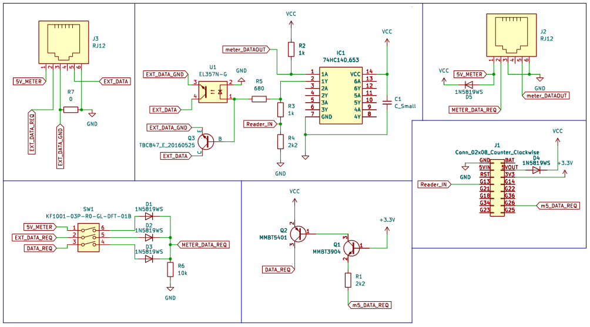

# P1-BASE-hardware Documentation

## Table of contents
- [P1-BASE-hardware Documentation](#p1-base-hardware-documentation)
  - [Table of contents](#table-of-contents)
  - [Usage](#usage)
  - [Design choices](#design-choices)
    - [Smart meter connection](#smart-meter-connection)
    - [Data Request Line Management](#data-request-line-management)
    - [Internal Splitter](#internal-splitter)
    - [Optional components](#optional-components)

## Usage

> This guide assumes that the PCB's are fully assembled, that the device has an enclosure and that the device has been programmed with the [needforheat-p1-reader-firmware](https://github.com/energietransitie/needforheat-p1-reader-firmware) 

* The 2x8 male pin header (`J1`) soldered to the bottom side of the PCB should be connected to the M5Stack CoreInk. Of the two possible orientations, use the  one with the best alignment of the outline of the P1-BASE PCB with the outline M5Stack CoreInk. 
* The upper female RJ12 connector (`J2`) should be connector via a (preferably short) 6P6C male-to make stright RJ12 cable to the P1 port of the smart meter. 
* The lower female RJ12 connector (`J3`) allows another smart meter reading device to be connected via a straight RJ12 cable.

Once these connections have been made, the user can open the NeedForHeat application on their phone and scan a QR code from the E-Ink screen of the M5Stack CoreInk. 

## Design choices

 </img>
The P1-BASE-hardware design was made as an improvement to the [twomes-p1-gateway-hardware](https://github.com/energietransitie/twomes-p1-gateway-hardware): 
* The hardware was developed to work on the M5Stack CoreInk instead of a bare ESP32.
* The [twomes-p1-gateway-hardware](https://github.com/energietransitie/twomes-p1-gateway-hardware) did not read P1 signals reliably from Landis+Gyr E360 series smart meters, such as the Landis+Gyr CD2D (meter code E0051) and CM3D (meter codes E0052 and E0067). The hardware design was also changed to address this problem and work on more smart meters.
* To allow  users who already have a smart meter reader connected to their smart meter, we added an internal P1 splitter to the design, which allows the user connect their smart meter reader to the bottom connector .

### Smart meter connection
The smart meter should be connected to upper female RJ12 connector (`J2`). A table of connections, referring to the official P1 port pin assignment can be seen below:

| Pin # | `J2` signal name     | P1 Signal Name | P1 Description     | P1 Remark              |
| ----- | -------------------- | -------------- | ------------------ | ---------------------- |
| 1     | `5V_METER`           | +5V            | +5V power supply   | Power supply line      |
| 2     | `METER_DATA_REQUEST` | Data Request   | Data Request Input |                        |
| 3     | `GND`                | Data GND       | Data ground        |                        |
| 4     |                      | n.c.           | Not connected      |                        |
| 5     | `meter_DATAOUT`      | Data           | Data line          | Output, Open collector |
| 6     | `GND`                | Power GND      | Power ground       | Power supply line      |

### Data Request Line Management
When the `Data Request` voltage (pin 2 on the female RJ12 connecor of the P1 port of the smart meter) is at `GND`+5V, the smart meter sends data.<!-- which GND, by the way? Can there be a difference?-->

The [twomes-p1-gateway-hardware/](https://github.com/energietransitie/twomes-p1-gateway-hardware/) design originally utilized a 10kΩ resistor and a 3.3V source, resulting in a high RC time constant and unreliable data reading. To address this, the design has been revised with a 1kΩ resistor and a 5V source, allowing for 5mA current flow and significantly improving signal integrity. The `meter_DATAOUT` signal is connected to a Schmitt-trigger (`IC1`) to enhance noise immunity. Transistors `Q1` and `Q2` are configured in a level-shifter circuit, converting the 3.3V logic signal (`m5_DATAREQ`) arriving from the M5Stack CoreInk via `G26` to a 5V logic signal (`DATA_REQ`), which is expected as `Data Request` input by the smart meter's P1-port.

### Internal Splitter

The internal splitter eliminates the need for external pre-wired components, simplifying user connections. It facilitates the addition of another smart meter reader without affecting the primary device's data request capabilities. Diodes are incorporated to prevent current flow to `GND` and ensure uninterrupted data request functionality. 

A DIP switch (`SW1`) enables configuration of `5V_METER`, `EXT_DATA_REQ`, and `DATA_REQ` signals to `METER_DATA_REQ`, linked via `J2` to the smart meter's data request line. For setup details, refer to the [DIP switch configuration section in the main README](../README.md#setting-the-dip-switches), which explains how these settings influence operational behavior.

### Optional components
* **Solder pads for `R7` and `Q3` are included on the PCB but not populated.** These components are provided for flexibility in adjusting the circuit's performance. They can be soldered if needed to enhance signal readout quality, particularly if the optocoupler (`U1`) proves insufficiently fast for the signals.

